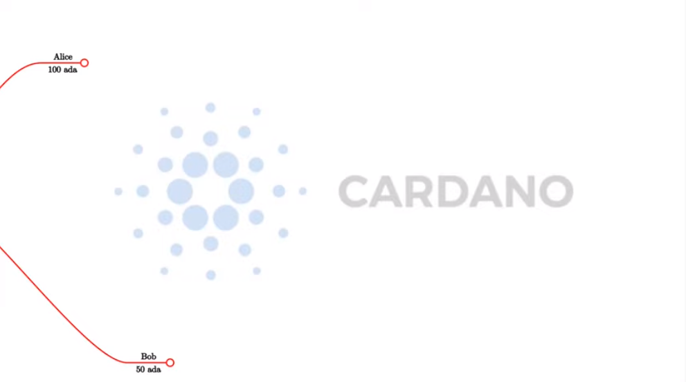
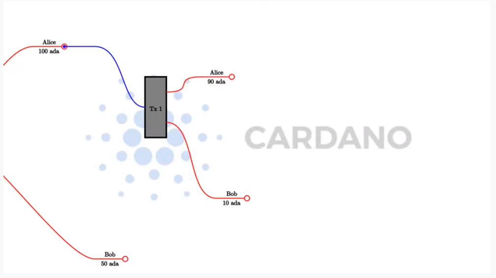
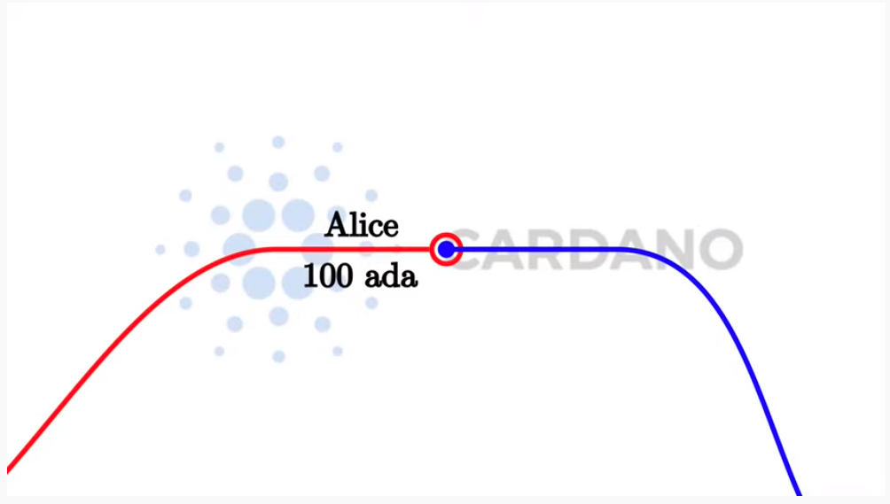
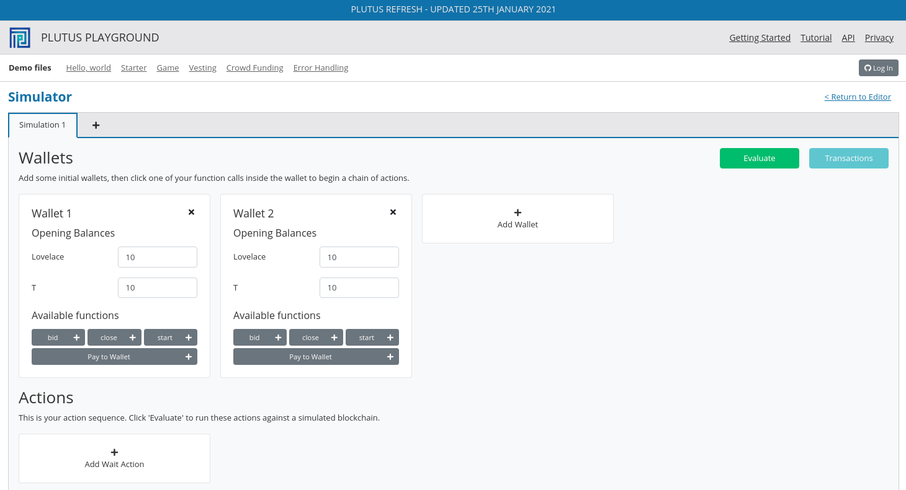

# Week 01

 [Lecture #1](https://youtu.be/IEn6jUo-0vU)

  - Welcome
  - The (E)UTxO-model
  - Running an example auction contract on a local Playground
  - Homework

## Welcome

Learning Plutus isn't easy, and there are a number of reasons for that.

1. Plutus uses the (E)UTxO model. This is different and less intuitive than the Ethereum method for creating smart contracts. It has a lot of advantages, but it requires a new way of thinking about smart contracts. And that's before we even start with the language itself.
2. Plutus is new and still under rapid development.
3. Tooling is not ideal, yet. So, experienced Haskell developers will notice that the experience with Plutus is not as pleasant, for example, when trying to access documentation or get syntax hints from the REPL. It can also be a challenge to build Plutus in the first place. The easiest way currently is to use Nix. The Plutus team is working on providing a Docker image, which will help.
4. Plutus is Haskell, more or less, which can have a tough learning curve for those coming from an imperative programming background.
5. Plutus is brand new and this means that there are not many help resources available, such as StackOverflow posts.

## The (E)UTxO Model

### Overview

One of the most important things you need to understand in order to write Plutus smart contracts is the accounting model that Cardano uses, the Extended Unspent Transaction Output model.

The UTxO model, without the (E) is the one that was introduced by Bitcoin, but there are other models. Ethereum for example, uses the so-called account-based model, which is what you are used to from normal banking, where everybody has an account and each account has a balance and if you transfer money from one account to another then the balances get updated accordingly. 

That is not how the UTxO model works.

Unspent transaction outputs are exactly what the name says. They are transaction outputs from previous transactions that have happened on the blockchain that have not yet been spent. Let's look at an example where we have two such UTxOs.

Alice wants to send 10 ADA to Bob, so she creates a transaction. A transaction is something that contains an arbitrary number of inputs and an arbitraty number of outputs.

The important thing is that you can only ever use complete UTxOs as input. Alice cannot simply split her existing 100 ADA into a 90 and a 10, she has to use the full 100 ADA as the input to a transaction.

Alice's transaction is no longer a UTxO (an unspent transaction). It has been spent as an input to Tx 1. And now, she can create outputs for her transaction.

She wants to pay 10 ADA to Bob, so one output will be 10 ADA (to Bob), and then she wants her change back so she creates a second output of 90 ADA (to herself). The full UTxO of 100 ADA has been spent, with Bob receiving a new transaction of 10 ADA, and Alice receiving the "change" of 90 ADA. 

In any transaction, the sum of the output values must match the sum of the input values. Although, strictly speaking, this is not true. There are two exceptions.

1. Transaction fees. In a real blockchain, you have to pay fees for each transactions.
2. Native Tokens. It's possible for transactions to create new tokens, or to burn tokens, in which case the inputs will be lower or higher than the outputs, depending on the scenario.

*The effect of a transaction is to consume inputs and produce new outputs.*

Let's take a look at a slightly more complicated example.

Alice and Bob want to transfer 55 ADA each to Charlie. Alice has no choice, as she only has one UTxO. Bob also has no choice as neither of his two UTxOs is large enough to cover the 55 ADA he wishes to send to Charlie. Bob will have to use both his UTxOs as input.

### When Is Spending Allowed?

Obviously it wouldn't be a good idea if any transaction could spend arbitrary UTxOs. If that was the case then Bob could spend Alice's money without her consent.

The way it works is by adding signatures to transactions.

In transaction 1, Alice's signature has to be added to the transaction.
In transaction 2, both Alice and Bob need to sign the transaction.

Everything explained so far is just about the UTxO model, not the (E)UTxO model.

The extended part comes in when we talk about smart contracts, so in order to understand that, let's concentrate on the consumption of Alice's UTxO of 100 ADA by Tx 1.

In the UTxO model, the validation that decides whether the transaction that this input belongs to is allowed to consume the UTxO, relies on digital signatures. In this case, that means that Alice has to sign the transaction in order for the consumption of the UTxO to be valid.

The idea of the (E)UTxO model is to make this more general.

Instead of having just one condition, namely that the appropriate signature is present in the transaction, we replace this with arbitrary logic. This is where Plutus comes in.

Instead of just having an address that corresponds to a public key that can be verified by a signature that is added to the transaction, we have more general logic, not based on public keys or the hashes of public keys, but instead arbitray logic which decides under which conditions a particular UTxO can be spent by particular transaction.

The input will justify that it is allowed to consume this output with some arbitrary piece of logic that is called the Redeemer.

What exactly does that mean?

It is important to consider the context that the script has. There are several options.

### The Bitcoin approach

One option is that all the script sees is the Redeemer. In this case, the Redeemer contains all the logic necessary to verify the transaction. This is, incidentally, what Bitcoin does. In Bitcoin, there are smart contracts, but they are just not very smart. They are called Bitcoin Script, which works exactly like this. There is a script on the UTxO side and a redeemer on the input side, and the script gets the redeemer and uses it to determine if it is ok to consume the UTxO or not.

But this is not the only option. We can decide to give more information to the script.

### The Ethereum approach

Ethereum uses a different concept. In Etheruem, the script can see everything - the whole blockchain - the opposite extreme of Bitcoin. In Bitcoin, the script has very little context, all it can see is the redeemer. In Ethereum, the Solidity scripts can see the complete state of the blockchain.

This makes Ethereum scripts more powerful, but it also comes with problems. Because the scripts are so powerful it is difficult to predict what a given script will do and that opens the door to all sorts of security issues and dangers. It is very hard for the developers of an Ethereum smart contract to predict everything that can happen.

### The Cardano approach

What Cardano does is something in the middle.

In Plutus, the script cannot see the whole blockchain, but it can see the whole transaction that is being validated. In contrast to Bitcoin, it can't see only the redeemer of the one input, but it can also see all the inputs and outputs of the transaction, and the transaction itself. The Plutus script can use this information to decide whether it is ok to consume the output.

There is one last ingredient that Plutus scripts need in order to be as powerful and expressive as Etheruem scripts. That is the so-called Datum. That is a piece of data that can be associated with a UTxO along with the UTxO value.

With this it is possible to prove mathematically that Plutus is at least as powerful as the Etheruem model - any logic you can express in Ethereum you can also it can express using the (E)UTxO model.

But it also has a lot of advantages compared to the Ethereum model. For example, in Plutus, it is possible to check whether a transaction will validate in your wallet, before you ever send it to the chain. 

Things can still go wrong with off-chain validation, however. For example in the situation where you submit a transaction that has been validated in the wallet but gets rejected when it attempts to consume an output on-chain that has already been consumed by another transaction.

In this case, your transaction will fail without you having to pay any fees.

But if all the inputs are still there that your transaction expects, then you can be sure that the transaction will validate and will have the predicted effect.

This is not the case with Ethereum. In Ethereum, the time between you constructing a transaction and it being incorporated into the blockchain, a lot of stuff can happen concurrently, and that is unpredictable and can have unpredicatable effects on what will happen when your script finally executes.

In Ethereum it is always possible that you have to pay gas fees for a transaction even if the transaction eventually fails with an error. And that is guaranteed to never happen with Cardano.

In addition to that, it is also easier to analyse a Plutus script and to check, or even prove, that it is secure, because you don't have to consider the whole state of the blockchain, which is unknowable. You can concentrate on this context that just consists of the spending transaction. So you have a much more limited scope and that makes it much easier to understand what a script is actually doing and what can possibly go wrong.

The (E)UTxO model is not tied to a particular programming language. What we have is Plutus, which is Haskell, but in principal you could use the same model with a completely different programming language, and we intend to write compilers for other programming languages to Plutus Script which is the "assembly" language underlying Plutus.

## Running an example auction contract on a local Playground

Rather than start the traditional way, i.e. starting very simple and doing a crash course on Haskell, followed by some simple Plutus contracts and slowly add more complicated stuff, it will be more interesting, especially for the first lecture, to showcase a more interesting contract and demonstrate what Plutus. We can then use that to look at certain concepts in more detail.

Before compiling the sample contract code, we need to setup Plutus. It is advisable to set up a Nix shell from the main Plutus repository at which can also be used to compile the example contracts.

[There are detailed notes on how to do this here](https://www.evernote.com/shard/s426/client/snv?noteGuid=b34acc67-c94b-fc64-9350-398a8f6fc6ec&noteKey=7e6b84c9501e9949eef2cadf6e35eaff&sn=https%3A%2F%2Fwww.evernote.com%2Fshard%2Fs426%2Fsh%2Fb34acc67-c94b-fc64-9350-398a8f6fc6ec%2F7e6b84c9501e9949eef2cadf6e35eaff&title=Installation).

This will setup your environment with the dependencies necessary to compile the sample contracts.

Once you are inside the Nix shell, you can start the Plutus client and server from the cloned Plutus repository.

The lecture videos were recorded at various times and the Plutus code that goes along with them was compiled against specific commits of the Plutus main branch. You can find the commit tag in the cabal.project file. My aim here is to keep this code up-to-date with the latest commits.

#### Server

    cd /path/to/plutus/repo/plutus-playground-client
    plutus-playground-server

#### Client

    cd /path/to/plutus/repo/plutus-playground-client
    npm run start

To check that everything is in order, you can then compile the code for Week 01. This is not  necessary to run the code in the playground, as the playground can compile the code itself.

    cd /path/to/plutus-pioneer-program/repo/code/week01
    cabal build all

### The English Auction contract

The code for the English Auction contract is at

    /path/to/plutus-pioneer-program/repo/code/week01/src/Week01/EnglishAuction.hs

We will run this contract in our local Plutus Playground.

If all went well above, you should be able to open the playground at https://localhost:8009. You will likely receive a certificate error, which can be bypassed.

Copy and paste the EnglishAuction.sh file contents into the playground, replacing the existing demo contract.

When using the original tag for Week 01 (3746610e53654a1167aeb4c6294c6096d16b0502), you will need to remove the "module" header from the script in order to compile it in the playground. This is not required in future iterations of Plutus.

Click the compile button. Once it has compiled, click the Simulate button.

